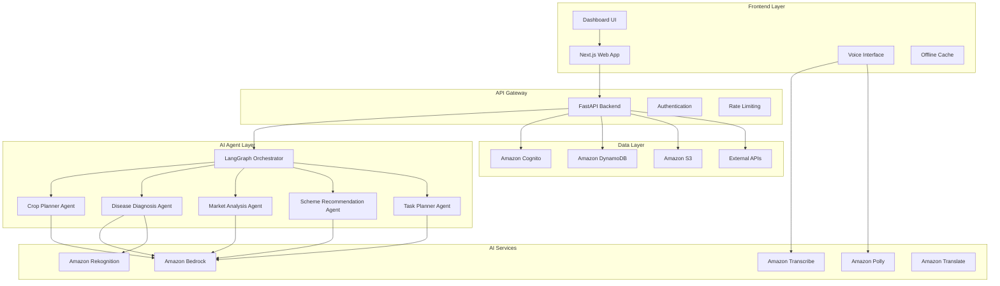

# Design Document: HanumanAI Platform

## Overview

HanumanAI is a voice-first, multilingual, agentic AI platform designed specifically for Indian farmers based on extensive field research with 30+ farmers in Kanpur, Uttar Pradesh. The platform serves as a "smart ally in the farmer's pocket," providing end-to-end agricultural decision-making support from crop planning to market selling.

The system architecture prioritizes voice interaction, low digital literacy support, offline capability, and localized recommendations. The platform uses a multi-agent AI approach where specialized agents collaborate to provide comprehensive agricultural guidance while maintaining simplicity for the end user.

### Key Design Principles

1. **Voice-First**: Primary interaction through speech in 22+ Indian languages
2. **Low Digital Literacy**: Icon-based navigation with minimal text dependency
3. **Offline Capability**: Essential functions work without internet connectivity
4. **Localized Intelligence**: All recommendations based on specific location and conditions
5. **Multi-Agent Architecture**: Specialized AI agents for different agricultural domains
6. **Real-Time Responsiveness**: Fast responses with automatic updates based on changing conditions

## Architecture

### High-Level Architecture



### Technology Stack

**Frontend:**
- Next.js 14 with TypeScript for the web application
- Tailwind CSS for responsive, mobile-first UI design
- Web Speech API for voice recognition and synthesis
- Progressive Web App (PWA) capabilities for offline support
- Service Workers for caching and background sync

**Backend:**
- FastAPI with Python for high-performance API development
- LangGraph for multi-agent workflow orchestration
- Pydantic for data validation and serialization
- AWS Lambda for serverless backend logic
- Amazon EKS for scalable container orchestration

**AI and ML:**
- Amazon Bedrock (Claude/Titan) for context-aware reasoning and recommendations
- Amazon Transcribe for multilingual voice recognition
- Amazon Polly for voice responses
- Amazon Rekognition for crop disease image analysis
- Amazon Translate for 22+ Indian languages support
- Prophet library for market price forecasting

**Database and Storage:**
- Amazon Cognito for secure user authentication
- Amazon DynamoDB for scalable data storage
- Amazon S3 for image and file storage
- Amazon ElastiCache (Redis) for caching frequently accessed data

**External Integrations:**
- data.gov.in APIs for government scheme information
- Amazon Location Service for location services and shop/mandi locations
- Weather APIs for localized forecasts
- Mandi price APIs for real-time market data

## Components and Interfaces

### 1. Voice Interface Component

The Voice Interface serves as the primary interaction layer, handling speech recognition, intent processing, and voice synthesis.

```typescript
interface VoiceInterface {
  // Core voice interaction methods
  startListening(language: string): Promise<void>
  stopListening(): void
  synthesizeSpeech(text: string, language: string): Promise<void>
  
  // Voice command processing
  processVoiceCommand(command: string, context: FarmProfile): Promise<ActionResult>
  
  // Language and accessibility
  setLanguage(language: SupportedLanguage): void
  adjustSpeechRate(rate: number): void
  enableOfflineMode(): void
}

interface VoiceCommand {
  intent: string
  entities: Record<string, any>
  confidence: number
  language: string
}

interface ActionResult {
  success: boolean
  response: string
  nextAction?: string
  data?: any
}
```

### 2. Farm Profile Management

Manages farmer and farm data, serving as the context foundation for all AI recommendations.

```typescript
interface FarmProfile {
  id: string
  farmerId: string
  name: string
  location: GeoLocation
  language: SupportedLanguage
  landArea: number
  soilType: SoilType
  soilComposition?: SoilHealthData
  irrigationMethods: IrrigationType[]
  waterSource: WaterSourceType
  previousCrops: CropHistory[]
  currentCrops: CurrentCrop[]
  createdAt: Date
  updatedAt: Date
}

interface SoilHealthData {
  ph: number
  nitrogen: number
  phosphorus: number
  potassium: number
  organicCarbon: number
  testDate: Date
  source: 'soil_health_card' | 'kvk_test' | 'manual_entry'
}

interface FarmProfileManager {
  createProfile(data: CreateFarmProfileRequest): Promise<FarmProfile>
  updateProfile(id: string, updates: Partial<FarmProfile>): Promise<FarmProfile>
  getProfile(id: string): Promise<FarmProfile>
  listProfiles(farmerId: string): Promise<FarmProfile[]>
  setActiveProfile(farmerId: string, profileId: string): Promise<void>
  getActiveProfile(farmerId: string): Promise<FarmProfile>
}
```

### 3. Multi-Agent AI System

The core intelligence layer using LangGraph to orchestrate specialized AI agents.

```typescript
interface AIAgent {
  name: string
  description: string
  process(input: AgentInput, context: FarmProfile): Promise<AgentOutput>
}

interface AgentInput {
  type: 'voice' | 'image' | 'text'
  content: string | ImageData
  metadata?: Record<string, any>
}

interface AgentOutput {
  recommendations: Recommendation[]
  confidence: number
  reasoning: string
  nextSteps?: string[]
  alerts?: Alert[]
}

// Specialized Agents
interface CropPlannerAgent extends AIAgent {
  generateCropPlan(preferences: CropPreferences, profile: FarmProfile): Promise<CropPlan>
  updatePlanForWeather(plan: CropPlan, weatherUpdate: WeatherData): Promise<CropPlan>
  recommendVarieties(crop: string, profile: FarmProfile): Promise<VarietyRecommendation[]>
}

interface DiseaseDiagnosisAgent extends AIAgent {
  diagnoseFromImage(image: ImageData, cropType: string): Promise<DiagnosisResult>
  diagnoseFromSymptoms(symptoms: string[], cropType: string): Promise<DiagnosisResult>
  getPreventiveMeasures(cropType: string, season: string, location: GeoLocation): Promise<PreventiveMeasure[]>
}

interface MarketAnalysisAgent extends AIAgent {
  analyzeMarketConditions(crop: string, location: GeoLocation): Promise<MarketAnalysis>
  generateSellingRecommendation(crop: string, quantity: number, profile: FarmProfile): Promise<SellingRecommendation>
  predictPriceTrends(crop: string, location: GeoLocation): Promise<PriceForecast>
}
```

### 4. Dashboard and Navigation

Simple, voice-navigable interface designed for low digital literacy users.

```typescript
interface Dashboard {
  // Core module access
  modules: DashboardModule[]
  activeProfile: FarmProfile
  
  // Voice navigation
  handleVoiceNavigation(command: string): Promise<NavigationResult>
  
  // Quick actions and alerts
  getQuickActions(profile: FarmProfile): Promise<QuickAction[]>
  getActiveAlerts(profile: FarmProfile): Promise<Alert[]>
  
  // First-time user flow
  initiateProfileSetup(): Promise<void>
}

interface DashboardModule {
  id: string
  name: string
  icon: string
  voiceCommands: string[]
  description: string
  enabled: boolean
}

interface QuickAction {
  id: string
  title: string
  description: string
  voiceCommand: string
  priority: 'high' | 'medium' | 'low'
  dueDate?: Date
}
```

### 5. Task Planning and Reminders

Converts AI recommendations into actionable, time-based tasks with voice reminders.

```typescript
interface TaskPlanner {
  generateTasksFromCropPlan(plan: CropPlan): Promise<Task[]>
  scheduleReminders(tasks: Task[], preferences: ReminderPreferences): Promise<void>
  updateTaskStatus(taskId: string, status: TaskStatus): Promise<void>
  rescheduleForWeather(tasks: Task[], weatherUpdate: WeatherData): Promise<Task[]>
}

interface Task {
  id: string
  title: string
  description: string
  category: TaskCategory
  priority: TaskPriority
  dueDate: Date
  estimatedDuration: number
  instructions: string[]
  resources?: Resource[]
  dependencies?: string[]
  status: TaskStatus
  completedAt?: Date
}

interface ReminderPreferences {
  methods: ('voice' | 'whatsapp' | 'sms')[]
  frequency: 'daily' | 'weekly' | 'as_needed'
  timeOfDay: string
  advanceNotice: number // hours before due date
}
```

## Data Models

### Core Data Structures

```typescript
// Geographic and Location Data
interface GeoLocation {
  latitude: number
  longitude: number
  address: string
  district: string
  state: string
  pincode: string
}

// Crop and Agricultural Data
interface CropPlan {
  id: string
  farmProfileId: string
  crop: string
  variety: string
  season: Season
  sowingDate: Date
  harvestDate: Date
  expectedYield: number
  estimatedProfit: number
  riskLevel: 'low' | 'medium' | 'high'
  
  // Detailed planning
  seedRequirement: SeedRequirement
  irrigationSchedule: IrrigationSchedule
  fertilizerPlan: FertilizerPlan
  pestManagement: PestManagementPlan
  
  // Tracking
  stages: CropStage[]
  actualProgress: ProgressTracking[]
  modifications: PlanModification[]
}

interface SeedRequirement {
  quantity: number
  unit: string
  variety: string
  treatment: SeedTreatment[]
  estimatedCost: number
  suppliers: Supplier[]
}

interface IrrigationSchedule {
  method: IrrigationType
  frequency: string
  waterRequirement: number // liters per week
  schedule: IrrigationEvent[]
  efficiency: number
}

interface FertilizerPlan {
  organic: FertilizerApplication[]
  inorganic: FertilizerApplication[]
  micronutrients: FertilizerApplication[]
  totalCost: number
  subsidyEligible: boolean
}

// Disease and Pest Management
interface DiagnosisResult {
  diseases: DiseaseIdentification[]
  confidence: number
  recommendations: TreatmentRecommendation[]
  preventiveMeasures: PreventiveMeasure[]
  urgency: 'immediate' | 'within_week' | 'monitor'
}

interface DiseaseIdentification {
  name: string
  localName: string
  scientificName: string
  confidence: number
  symptoms: string[]
  referenceImages: string[]
  severity: 'mild' | 'moderate' | 'severe'
}

interface TreatmentRecommendation {
  type: 'organic' | 'chemical' | 'biological'
  products: Product[]
  dosage: Dosage
  applicationMethod: string
  timing: string[]
  precautions: string[]
  cost: number
}

// Market and Economic Data
interface MarketAnalysis {
  currentPrice: number
  priceRange: PriceRange
  trend: 'rising' | 'falling' | 'stable'
  recommendation: 'sell' | 'hold' | 'sell_urgently'
  reasoning: string
  nearbyMandis: MandiInfo[]
  profitCalculation: ProfitCalculation
}

interface MandiInfo {
  name: string
  location: GeoLocation
  distance: number
  currentPrice: number
  transportCost: number
  netPrice: number
  facilities: string[]
}

// Government Schemes
interface GovernmentScheme {
  id: string
  name: string
  description: string
  benefits: string[]
  eligibility: EligibilityCriteria
  documents: RequiredDocument[]
  applicationProcess: ApplicationStep[]
  deadline?: Date
  contactInfo: ContactInfo
  category: SchemeCategory
}

interface EligibilityCriteria {
  landSize?: { min?: number; max?: number }
  crops?: string[]
  location?: string[]
  income?: { max: number }
  other: string[]
}
```

### Database Schema Design

The system uses Amazon DynamoDB with the following table structure:

```
Farmers Table:
  PK: farmerId
  - personalInfo: FarmerPersonalInfo
  - preferences: UserPreferences
  - createdAt: timestamp
  - lastActive: timestamp

FarmProfiles Table:
  PK: profileId
  GSI1: farmerId
  - farmerId: string
  - profileData: FarmProfile
  - isActive: boolean

CropPlans Table:
  PK: planId
  GSI1: farmProfileId
  - farmProfileId: string
  - planData: CropPlan
  - status: 'draft' | 'active' | 'completed'

Tasks Table:
  PK: taskId
  GSI1: farmProfileId
  - farmProfileId: string
  - taskData: Task
  - reminders: ReminderSchedule[]

Diagnoses Table:
  PK: diagnosisId
  GSI1: farmProfileId
  - farmProfileId: string
  - diagnosisData: DiagnosisResult
  - images: string[] (S3 URLs)
  - followUp: FollowUpAction[]

MarketData Table:
  PK: cropType#location
  - priceHistory: PricePoint[]
  - lastUpdated: timestamp
  - sources: string[]

Schemes Table:
  PK: schemeId
  GSI1: state
  - schemeData: GovernmentScheme
  - applicableStates: string[]
  - lastUpdated: timestamp
```

## Correctness Properties

*A property is a characteristic or behavior that should hold true across all valid executions of a system—essentially, a formal statement about what the system should do. Properties serve as the bridge between human-readable specifications and machine-verifiable correctness guarantees.*

Before defining the correctness properties, let me analyze the acceptance criteria from the requirements to determine which ones are testable as properties.

### Property 1: Voice Interface Multilingual Functionality
*For any* supported Indian language and any farmer interaction, the Voice_Interface should accurately convert speech to text, process the intent using the active Farm_Profile context, and respond with clear, actionable voice instructions in the same language, with offline support for basic commands when connectivity is limited.
**Validates: Requirements 1.1, 1.2, 1.3, 1.4, 1.5, 1.6**

### Property 2: Farm Profile Context Consistency
*For any* AI-generated recommendation across all modules, the system should use the currently active Farm_Profile as the primary decision context, ensuring all advice is personalized to the farmer's specific land, resources, crops, and historical data.
**Validates: Requirements 2.1, 2.2, 2.3, 2.4, 2.5, 2.6**

### Property 3: Comprehensive Crop Plan Generation
*For any* crop planning request, the AI_Agent should generate a complete day-by-day Crop_Plan that includes all mandatory components (sowing windows, seed estimation, water requirements, fertilizer recommendations, pest prevention, harvest guidance) using the active Farm_Profile, weather data, and soil information.
**Validates: Requirements 3.1, 3.2, 3.3, 3.4, 3.6, 3.8**

### Property 4: Adaptive Plan Management
*For any* significant change in weather conditions, farm parameters, or farmer execution feedback, the system should automatically update the Crop_Plan and convert changes into actionable weekly targets and daily tasks while learning from farmer behavior to improve future recommendations.
**Validates: Requirements 3.5, 3.7**

### Property 5: Market Analysis Profit Optimization
*For any* market information request, the system should fetch real-time government-sourced mandi prices, analyze all relevant factors (historical trends, transport costs, weather risks), calculate accurate take-home profit, and rank nearby mandis by net profitability while providing timely weather-based selling alerts.
**Validates: Requirements 4.1, 4.2, 4.3, 4.4, 4.5, 4.6, 4.7**

### Property 6: Multi-Modal Disease Diagnosis
*For any* crop health concern provided via image upload or voice symptom description, the Disease_Diagnosis system should identify the top three probable diseases with confidence scores, provide step-by-step treatment plans (organic and chemical) with dosages adjusted for crop type and farm size, and include local medicine shop information.
**Validates: Requirements 5.1, 5.2, 5.3, 5.4, 5.5, 5.6, 5.7, 5.9**

### Property 7: Proactive Disease Prevention
*For any* location and crop combination during any season, the system should maintain localized disease knowledge and issue proactive alerts when risk patterns are detected, providing early warning and preventive measures before diseases occur.
**Validates: Requirements 5.8**

### Property 8: Government Scheme Matching and Guidance
*For any* farmer profile and location, the system should accurately identify relevant government schemes, assess eligibility based on farmer data, present schemes in simple card format, provide multilingual voice-enabled help for application processes, and proactively notify farmers of new time-sensitive schemes.
**Validates: Requirements 6.1, 6.2, 6.3, 6.4, 6.5, 6.6**

### Property 9: Intelligent Task Management
*For any* finalized or modified Crop_Plan, the Task_Planning system should automatically convert the plan into structured task schedules with clear explanations, deliver timely voice-based reminders, allow voice-based task completion confirmation, and dynamically reschedule tasks based on weather changes and priority levels.
**Validates: Requirements 7.1, 7.2, 7.3, 7.4, 7.5, 7.6**

### Property 10: Adaptive Task Learning
*For any* farmer's task completion behavior over time, the system should learn response patterns and adjust reminder frequency and timing to optimize farmer engagement without overwhelming the user.
**Validates: Requirements 7.7**

### Property 11: Multi-Modal Input Integration
*For any* farmer interaction session, the system should seamlessly accept and combine voice commands, image uploads, and touch interactions while maintaining context across different input modalities, providing appropriate fallbacks when any input method fails, and requesting alternatives when input quality is insufficient.
**Validates: Requirements 8.1, 8.2, 8.3, 8.4, 8.5**

### Property 12: Comprehensive Language Support
*For any* of the 22+ supported Indian languages, the system should provide consistent functionality across all core modules, maintain context when language is changed mid-session, ensure all critical actions work without English dependency, and deliver all content using simple, farmer-friendly language appropriate to the selected locale.
**Validates: Requirements 9.1, 9.2, 9.3, 9.4, 9.5, 9.6**

### Property 13: Localized Data Integration
*For any* farmer location, the system should incorporate location-specific weather forecasts, soil conditions, regional farming practices, nearby market information, and applicable government schemes while maintaining regional databases of crop varieties and pest patterns.
**Validates: Requirements 10.1, 10.2, 10.3, 10.4, 10.5**

### Property 14: Security and Data Protection
*For any* farmer registration and data interaction, the system should provide secure phone-based OTP authentication, encrypt all stored personal and farm data, maintain secure HTTPS communications, manage session timeouts appropriately, and provide compliant data deletion capabilities upon request.
**Validates: Requirements 11.1, 11.2, 11.3, 11.4, 11.5**

### Property 15: Performance and Scalability
*For any* system interaction, the platform should respond within specified time limits (3 seconds for cached data, 10 seconds for AI recommendations), maintain performance with up to 10,000 concurrent users, auto-scale to handle load increases, deliver critical alerts within 1 minute, and maintain 99.5% uptime during peak farming seasons.
**Validates: Requirements 12.1, 12.2, 12.3, 12.4, 12.5**

### Property 16: Dashboard Usability and Navigation
*For any* farmer accessing the platform, the dashboard should present a clean, icon-based interface with voice navigation to all modules, guide first-time users through profile creation, surface relevant personalized content for returning users, immediately reflect context changes (farm/language switches), and maintain consistency across languages and devices.
**Validates: Requirements 13.1, 13.2, 13.3, 13.4, 13.5, 13.6, 13.7**

## Error Handling

The HanumanAI platform implements comprehensive error handling strategies designed for low digital literacy users and unreliable connectivity environments.

### Voice Interface Error Handling

**Speech Recognition Failures:**
- Automatic retry with improved audio processing
- Fallback to simplified voice prompts
- Visual alternatives for critical functions
- Context-aware clarification requests

**Language Processing Errors:**
- Graceful degradation to simpler language models
- Fallback to English with voice translation
- Context preservation across error recovery
- User-friendly error explanations in local language

### Connectivity and Offline Handling

**Network Disconnection:**
- Automatic detection of connectivity loss
- Seamless switch to offline mode
- Local cache utilization for essential functions
- Background synchronization when connectivity returns

**API Failures:**
- Retry mechanisms with exponential backoff
- Fallback to cached data when available
- Alternative data sources for critical information (Amazon Athena for price analysis)
- User notification of service limitations

### Data Validation and Input Handling

**Invalid Farm Profile Data:**
- Real-time validation with helpful error messages
- Guided correction flows with voice assistance
- Default value suggestions based on location
- Progressive data collection to reduce errors

**Image Quality Issues:**
- Automatic image quality assessment
- Guided retake instructions with voice prompts
- Alternative symptom description flows
- Reference image examples for comparison

### AI Agent Error Handling

**Recommendation Generation Failures:**
- Fallback to rule-based recommendations
- Partial recommendation delivery with disclaimers
- Alternative agent consultation
- User notification with retry options

**Confidence Threshold Management:**
- Low confidence recommendation flagging
- Multiple option presentation with explanations
- Expert consultation suggestions
- User feedback integration for improvement

## Testing Strategy

The HanumanAI platform employs a comprehensive dual testing approach combining unit tests for specific scenarios and property-based tests for universal correctness validation.

### Property-Based Testing Framework

**Technology Selection:**
- **Python**: Hypothesis library for backend API and AI agent testing
- **TypeScript**: fast-check library for frontend and integration testing
- **Configuration**: Minimum 100 iterations per property test to ensure comprehensive input coverage

**Property Test Implementation:**
Each correctness property will be implemented as a dedicated property-based test with the following structure:

```python
# Example property test structure
@given(farm_profile=farm_profile_strategy(), 
       voice_input=multilingual_voice_strategy())
def test_voice_interface_multilingual_functionality(farm_profile, voice_input):
    """
    Feature: hanuman-ai-platform, Property 1: Voice Interface Multilingual Functionality
    
    For any supported Indian language and any farmer interaction, 
    the Voice_Interface should accurately convert speech to text, 
    process intent using active Farm_Profile context, and respond 
    with clear, actionable voice instructions in the same language.
    """
    # Test implementation
    pass
```

**Test Data Generation Strategies:**
- **Farm Profiles**: Generate diverse combinations of location, crops, soil types, and farm sizes
- **Voice Inputs**: Create multilingual speech samples across 22+ Indian languages
- **Market Data**: Generate realistic price variations and market conditions
- **Weather Data**: Create diverse weather scenarios and seasonal patterns
- **Disease Images**: Generate synthetic crop images with various disease symptoms

### Unit Testing Strategy

**Focused Unit Test Areas:**
- **Authentication flows**: OTP verification, session management, security edge cases
- **API integrations**: External service failures, data format validation, rate limiting
- **Edge cases**: Boundary conditions for farm sizes, extreme weather events, rare diseases
- **Error conditions**: Network failures, invalid inputs, service unavailability
- **Integration points**: Database operations, file uploads, notification delivery

**Unit Test Balance:**
Unit tests complement property-based tests by focusing on:
- Specific examples that demonstrate correct behavior
- Integration points between system components  
- Edge cases and error conditions that are difficult to generate randomly
- Regression prevention for known issues

Property-based tests handle comprehensive input coverage and universal correctness validation.

### Integration Testing

**End-to-End Scenarios:**
- Complete farmer journey from registration to crop harvest
- Multi-modal interaction flows (voice + image + touch)
- Cross-language functionality testing
- Offline-to-online synchronization scenarios

**Performance Testing:**
- Load testing with 10,000+ concurrent users
- Response time validation under various conditions
- Memory usage and resource optimization
- Auto-scaling behavior verification

### Accessibility and Usability Testing

**Low Digital Literacy Validation:**
- Voice-only interaction testing
- Icon-based navigation verification
- Language simplicity assessment
- Error message clarity evaluation

**Multilingual Testing:**
- Accuracy testing across all 22+ supported languages
- Cultural appropriateness of recommendations
- Local dialect recognition capabilities
- Cross-language context preservation

### Continuous Testing Pipeline

**Automated Testing Integration:**
- Property-based tests in CI/CD pipeline
- Performance regression detection
- Security vulnerability scanning
- Accessibility compliance checking

**Field Testing Integration:**
- Real farmer feedback incorporation
- Regional accuracy validation
- Cultural sensitivity verification
- Practical usability assessment

This comprehensive testing strategy ensures that HanumanAI meets the rigorous requirements for serving Indian farmers with reliable, accurate, and accessible agricultural guidance while maintaining high performance and security standards.